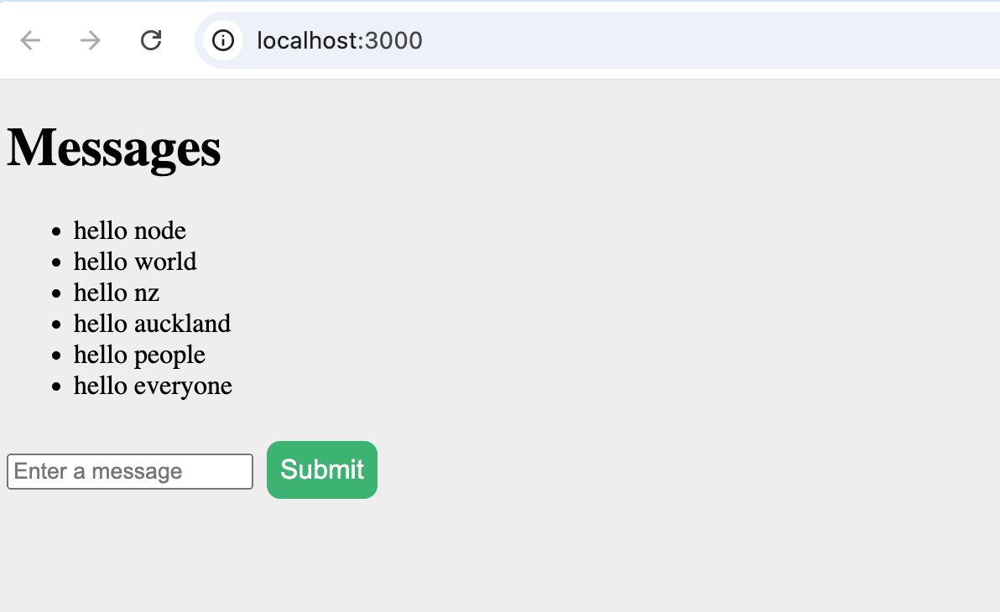
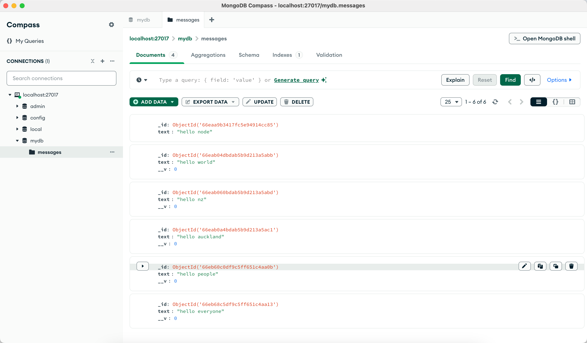

## React.js setup steps

1. 初始化项目

    项目文件夹下使用脚手架创建react app

    ```bash
    npx create-react-app frontend
    cd frontend
    ```

2. 安装 Axios 进行 API 请求

    前端项目目录frontend下进入终端，执行

    ```bash
    npm install axios
    ```

    **Axios**: 用于发送api请求。

3. 创建前端页面组件

    编辑 `src/App.js`，发送请求获取 "hello node" 消息并显示在页面中：

    ```js
    import React, { useEffect, useState } from 'react';
    import axios from 'axios';
    
    function App() {
      const [messages, setMessages] = useState([]);
      const [newMessage, setNewMessage] = useState('');
    
      // 获取所有消息
      useEffect(() => {
        axios.get('http://localhost:5001/api/message')
          .then(response => {
            setMessages(response.data); // 设置获取到的消息
          })
          .catch(error => {
            console.error('Error fetching the messages:', error);
          });
      }, []);
    
      // 处理输入框变化
      const handleInputChange = (e) => {
        setNewMessage(e.target.value);
      };
    
      // 提交新消息
      const handleSubmit = () => {
        if (newMessage.trim()) {
          axios.post('http://localhost:5001/api/message', { text: newMessage })
            .then(response => {
              setMessages([...messages, response.data]); // 更新消息列表
              setNewMessage(''); // 清空输入框
            })
            .catch(error => {
              console.error('Error posting the message:', error);
            });
        }
      };
    
      return (
        <div>
          <h1>Messages</h1>
          <ul>
            {messages.map((message, index) => (
              <li key={index}>{message.text}</li>
            ))}
          </ul>
          <div>
            <input
              type="text"
              value={newMessage}
              onChange={handleInputChange}
              placeholder="Enter a message"
            />
            <button onClick={handleSubmit}>Submit</button>
          </div>
        </div>
      );
    }
    
    export default App;
    
    ```

4. 启动 React 前端

    在 frontend` 项目目录中启动开发服务器：

     ```bash
     npm start
     ```

    React 应用会在 `http://localhost:3000` 运行。

5. 运行和测试

    1. 确保 MongoDB 服务器已启动，并且数据库中已插入 `"hello node"`。

    2. 在 `backend` 项目中启动 Express 服务器：

    ```bash
    node server.js
    ```

    3. 确保前后端通信正常（React 前端运行在 `http://localhost:3000`，Express 后端运行在 `http://localhost:5001`）。

6. 页面显示实例：

    1. 页面渲染

        

        
    
    2. 数据库
    
        
